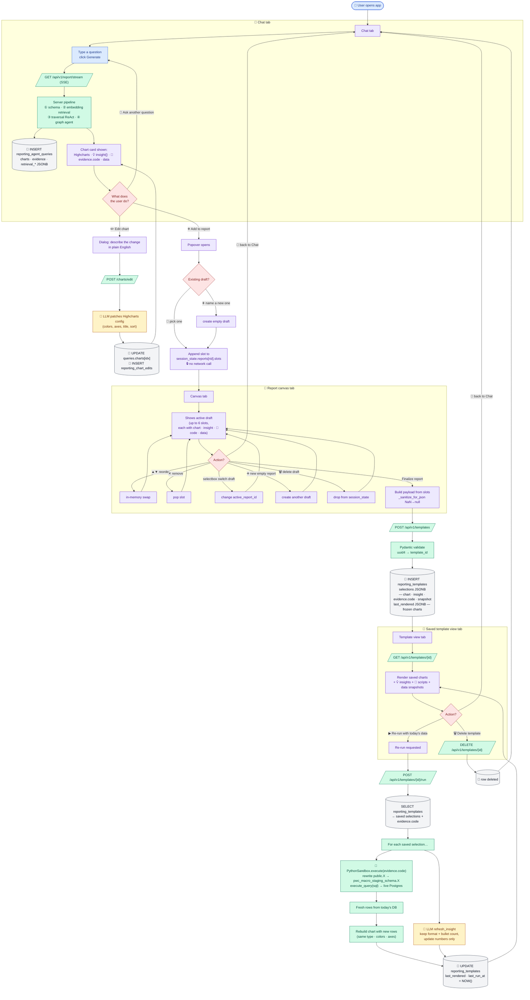

# Report Canvas — end-to-end flow

Everything that happens from the moment a chart appears in Chat to the moment
a saved report re-renders with today's data. File:line pointers throughout so
you can jump straight into the source.

> **Short answer to "is the Python script saved for each chart?"** — **Yes.**
> The full Python + SQL the traversal agent executed is persisted in
> `reporting_templates.selections[i].evidence.code`. On re-run, the sandbox
> executes that exact script again — same filters, same joins, same shape —
> against today's Postgres, and the chart is redrawn with the new numbers.

---

## 0 · Chart lifecycle at a glance

```
[Chat tab]               [Add to report popover]        [Report canvas tab]
query ──► SSE pipeline ──► chart card rendered ──► slot in session state ──► POST /templates ──► row in Postgres
                                                                               │
                                                                               ▼
                                                                      [Template view tab]
                                                                      POST /templates/{id}/run
                                                                               │
                                                                               ▼
                                                                      sandbox re-executes every saved script
                                                                      LLM refreshes each insight
                                                                      UPDATE last_rendered + last_run_at
```

---

## 1 · A chart arrives in the Chat tab

- User types a question, clicks **Generate** → [`streamlit_app.py:_run_query`](../streamlit_app.py).
- Opens an SSE stream: `GET /api/v1/report/stream?query=…&thread_id=…` ([app/api/v1/endpoints/sse_report.py](../app/api/v1/endpoints/sse_report.py)).
- Events received in order: `stream_started` → `step` (×4) → `retrieval_done` → `traversal_done` → `complete`.
- On `complete`, Streamlit appends to `st.session_state.queries`:

```python
{
  "query_id":           <uuid from server>,
  "query":              <the natural-language question>,
  "project_type":       "NTM" | "AHLOB Modernization" | "Both",
  "charts":             [ <Highcharts config>, ... ],   # each one includes:
                        #   - chart / title / xAxis / yAxis / series
                        #   - description           (1-sentence takeaway)
                        #   - insight {}            (headline, what_the_data_shows[], why_it_matters[], recommended_next_step)
                        #   - evidence_sql_index    (which SQL call produced this chart)
                        #   - evidence {}           ← attached by graph_agent._attach_evidence_to_charts
                        #        sql_index
                        #        code     ← full Python + SQL the traversal agent ran
                        #        result   ← {summary, detail_rows, total_rows} returned by sandbox
                        #        status   ← "success" | "error"
                        #        error
  "rationale":          <report-level 2-3 sentence summary>,
  "traversal_steps":    <int>,
  "traversal_findings": <agent's findings summary>,
  "evidence":           [ {sql_index, code, result, status, error}, ... ],   # same rows, keyed by sql index
  "retrieval_nodes":    [ {score, label, node_id, entity_type, ...}, ... ],
  "retrieval_paths":    [ {score, hops, node_labels, ...}, ... ],
}
```

**No DB write from Streamlit yet** — persistence of the query itself happens
server-side in `/report/stream`, which writes a row to
`pwc_agent_utility_schema.reporting_agent_queries` with the same `charts` +
`evidence` JSONB.

---

## 2 · Add chart to canvas (click ➕ Add to report → <draft>)

**API calls:** none. Purely in-memory session state.

[`streamlit_app.py:_add_to_report`](../streamlit_app.py) appends one slot dict
to `st.session_state.reports[<rid>]["slots"]`:

```python
slot = {
  "source":         f"{query_id}:{chart_index}",   # dedupe key
  "chart":          <full chart config — reference to the same dict in queries[]>,
  "evidence":       chart["evidence"],              # ← the script + row snapshot
  "query_id":       query_id,
  "chart_index":    chart_index,
  "original_query": "<the natural-language question>",
}
```

The chart dict is a **live reference** — if the user opens the ✏️ Edit chart
dialog on that chart later and changes e.g. bar colors, `_sync_chart_everywhere`
([streamlit_app.py](../streamlit_app.py)) walks every draft and swaps in the
patched config so the canvas stays in sync.

Guards:
- 6 slots max per draft (`MAX_REPORT_CHARTS`).
- A source key can only appear once per draft.
- A chart can live in multiple drafts at once.

---

## 3 · Finalize the report (Report canvas tab → **Finalize report**)

Click builds a `payload` from the active draft's slots ([streamlit_app.py](../streamlit_app.py)):

```python
payload = {
  "user_id":      <sidebar>,
  "username":     <sidebar>,
  "thread_id":    st.session_state.thread_id,
  "title":        <editable — prefilled with draft name>,
  "project_type": <sidebar>,
  "selections": [
    {
      "query_id":       slot["query_id"],
      "chart_index":    slot["chart_index"],
      "chart":          slot["chart"],       # full Highcharts config + insight + evidence
      "evidence":       slot["evidence"],    # {code, result, status, error, sql_index}
      "original_query": slot["original_query"],
    },
    ...  # up to 6 entries
  ],
}
```

The payload is run through `_sanitize_for_json(payload)` to replace any `NaN`
/ `Inf` floats with `None` (pandas `to_dict('records')` can emit them for
missing cells — strict JSON would otherwise reject).

### API call

```
POST /api/v1/templates
Content-Type: application/json

<payload as above>
```

### Server side — [`app/api/v1/endpoints/templates.py:create_template`](../app/api/v1/endpoints/templates.py)

1. Pydantic validates the body against `TemplateIn` + `TemplateSelectionIn`.
2. Rejects empty / >6 selections with HTTP 400.
3. Generates `template_id = uuid4()`.
4. Builds a frozen `last_rendered = {"charts": [s.chart for s in selections]}` — the canvas rendering you see before you click Re-run.
5. Calls [`db_service.create_template`](../app/services/db_service.py) which `INSERT`s one row into
   `pwc_agent_utility_schema.reporting_templates`:

| column           | value                                                                                              |
|------------------|----------------------------------------------------------------------------------------------------|
| `template_id`    | new UUID                                                                                           |
| `user_id`        | from payload                                                                                       |
| `username`       | from payload                                                                                       |
| `thread_id`      | links back to the chat thread that produced the charts                                             |
| `title`          | user-typed                                                                                         |
| `project_type`   | from payload                                                                                       |
| `selections`     | JSONB · full array of `{query_id, chart_index, chart, evidence, original_query}` (sanitized)       |
| `last_rendered`  | JSONB · `{"charts": [...]}` snapshot at finalize time (sanitized)                                  |
| `created_at`     | `NOW()`                                                                                            |
| `last_run_at`    | `NOW()`                                                                                            |

Response: `200 { "template_id": "<uuid>" }`.

Streamlit then clears the template list cache and jumps to the **Saved
template view** tab preloaded with the new `template_id`.

### What you can reconstruct from this row alone

- Every chart's config, title, colors, axes, description, structured `insight{}`, manual `_edit_history`.
- The Python + SQL script that produced each chart's data (`selections[i].evidence.code`).
- A snapshot of the rows the chart was built from (`selections[i].evidence.result` — `summary`, `detail_rows`, `total_rows`).
- Provenance — which chat thread, which query, the original natural-language question.

---

## 4 · Re-run the report (Saved template view → **▶ Re-run with today's data**)

### API call

```
POST /api/v1/templates/{template_id}/run
```

### Server side — [`app/api/v1/endpoints/templates.py:run_template`](../app/api/v1/endpoints/templates.py)

Step-by-step:

1. **Fetch template row.** `db_service.get_template(template_id)` reads the row. 404 if missing.
2. **Parse `selections`.** Deserialized to a Python list (handles either native dict or stringified JSON).
3. **For each selection (in order):**

   a. `code = selection.evidence.code` — the exact Python + SQL saved at finalize.

   b. `fresh = _run_one_script(code)` → invokes a fresh `PythonSandbox` via
      `sandbox.execute(code, timeout=45)`. The sandbox:
      - Re-writes any stray `public.<non-allowlisted-table>` → `pwc_macro_staging_schema.<table>` ([`python_sandbox._rewrite_public_schema`](../app/tools/python_sandbox.py)).
      - Pre-injects `execute_query(sql)`, `conn`, `pd`, `np`, `json`.
      - Executes the script, captures `namespace["result"]`.
      - Enforces a 45 s wall-clock timeout.

   c. **Refresh the chart.** `_rebuild_chart_with_fresh_data(chart, fresh)`:
      - Deep-copies the saved chart so types/axes/colors/title stay identical.
      - Picks the first list of dicts it can find in the fresh result (`chart_data` → `rows` → `data` → `series` → `detail_rows`).
      - Uses the first column as categories and the first numeric column as values, then overwrites `series[0].data` and `xAxis.categories`.
      - Pie-charts get the `[{name, y}, ...]` shape instead.
      - Appends `(refreshed)` to the subtitle so the UI can flag it.

   d. **Refresh the insight.** If the saved chart has an `insight` object,
      [`insight_refresh.refresh_insight`](../app/services/insight_refresh.py)
      calls `gpt-4o` with the **original insight as a format template** and
      the fresh data, returning a new structured object with the same four
      sections (`headline`, `what_the_data_shows[]`, `why_it_matters[]`,
      `recommended_next_step`). Any LLM error → keep the original insight.

   e. **If the script failed:** skip the remap, mark the subtitle with
      `(refresh failed — showing saved data)`, render the stored chart
      unchanged.

   f. Append a row to `script_reports`:
      `{query_id, chart_index, status, error, elapsed_ms}`.

4. **Persist.** `db_service.update_template_render(template_id, {...})`
   overwrites the `last_rendered` JSONB column with
   `{"charts": [...refreshed...], "script_reports": [...], "rendered_at": <ts>}`
   and bumps `last_run_at = NOW()`.

5. **Return** that same JSON body to Streamlit so the tab can redraw
   immediately without needing a follow-up GET.

### What the user sees in the Template View tab after re-run

- Every chart redrawn with today's numbers (same title/type/colors, subtitle gets `(refreshed)`).
- Every `💡 Insight` replaced — same section layout, new numbers, new bullets.
- A "Script run report" expander listing one row per chart with `status`, `error`, `elapsed_ms` so you can see at a glance whether any script failed.
- The exact Python + SQL that ran, shown under each chart (**🐍 Python + SQL script (re-runnable against today's data)**).

---

## 5 · Delete a template

- Sidebar trash button (two-click confirm) **or** Template view's **🗑 Delete**.
- `DELETE /api/v1/templates/{template_id}` → `db_service.delete_template` removes the row. No soft-delete.

---

## 6 · The full API surface exercised by this flow

| Endpoint | Called from | Purpose |
|---|---|---|
| `GET /api/v1/report/stream` | Chat tab, on Generate | SSE pipeline; produces a chart with `evidence.code` attached |
| `GET /api/v1/templates?user_id=` | Sidebar load | Lists user's saved templates |
| `POST /api/v1/templates` | Canvas → Finalize | Persists the draft as a template row |
| `GET /api/v1/templates/{id}` | Template view tab load | Fetches one template + last_rendered |
| `POST /api/v1/templates/{id}/run` | Template view tab → Re-run | Executes every saved script, remaps charts, refreshes insights |
| `DELETE /api/v1/templates/{id}` | Sidebar / Template view | Drops the template row |

There is **no endpoint** for "add to canvas" — that's a pure client-side action,
and nothing crosses the network until the user finalizes.

---

## 7 · Reproducibility guarantees (and their limits)

**What is guaranteed reproducible:**

- The chart's **shape** (type, axes, title, colors, subtitle) is byte-for-byte preserved in the saved config.
- The **script** is saved verbatim — same filters (e.g. `smp_name = 'NTM'`), same joins, same aggregations. Re-running it on unchanged Postgres state returns the same rows.
- The **evidence snapshot** (`evidence.result`) is a frozen copy of what the chart was built from — if today's DB is empty or broken, the UI falls back to this snapshot so the report still renders.

**What changes on re-run:**

- The numbers in the bars/lines/slices, because the script queries live Postgres.
- The `insight` text, because it's regenerated against the fresh numbers (same format, same bullet count, but fresh claims).
- `last_rendered.charts` is overwritten each run; the **saved `selections` are never touched** so the "source of truth" can't drift.

**What can legitimately differ between runs:**

- Underlying staging tables (e.g. `pwc_macro_staging_schema.stg_ndpd_mbt_tmobile_macro_combined`) evolve day-to-day — that's the whole point of re-run.
- If a column/table referenced in the saved script gets renamed or dropped, that chart's re-run fails and the UI falls back to the saved snapshot + a red `X` in the script run report.

---

## 8 · Storage layout (Postgres, `pwc_agent_utility_schema`)

```
reporting_agent_queries
  ├─ query_id (PK)
  ├─ thread_id, user_id, username
  ├─ original_query, project_type, max_charts
  ├─ status, charts (JSONB), rationale, evidence (JSONB), traversal_findings, traversal_steps, errors
  └─ started_at, completed_at, duration_ms

reporting_chat_threads
  ├─ thread_id (PK)
  ├─ user_id, username, title, project_type
  └─ created_at, updated_at

reporting_chart_edits
  ├─ edit_id (PK, BIGSERIAL)
  ├─ query_id, chart_index
  ├─ instruction, patched_chart (JSONB)
  └─ created_at

reporting_templates          ← the Report Canvas lives here
  ├─ template_id (PK)
  ├─ user_id, username, thread_id, title, project_type
  ├─ selections (JSONB)       ← every chart + its full evidence + the script
  ├─ last_rendered (JSONB)    ← most recent re-run output
  └─ created_at, last_run_at
```

---

## 9 · The whole flow in one diagram

Starting from "user opens the app", every possible branch, every API call,
every DB write, and every in-memory action in a single picture.



**Legend**

| Colour | Meaning |
|---|---|
| 🟦 blue | User action |
| 🟣 purple | Streamlit client (in-memory, no network) |
| 🟢 green | FastAPI endpoint / server logic |
| 🟡 yellow | LLM call (OpenAI) |
| ⬜ grey | Postgres write / read |
| 🟥 red | Decision point (user branches) |

**What to notice**

1. **Only three places make a network call from the user's actions**:
   (a) ask a question `GET /report/stream`, (b) edit a chart `POST /charts/edit`,
   (c) anything template-related (`POST /templates`, `GET`, `POST …/run`, `DELETE`).
   Everything inside Canvas tab and the "Add to report" popover is pure
   in-memory session state.
2. **The chart's Python + SQL (`evidence.code`) is the reusable artifact** —
   written once at SSE time, copied into the `reporting_templates.selections`
   JSONB on Finalize, and replayed on every Re-run. That's what guarantees
   the same chart shape with today's numbers.
3. **Insight is regenerated, not replayed** — the LLM gets the original
   insight as a format template plus today's data, so the four sections
   (`headline`, `what_the_data_shows`, `why_it_matters`, `recommended_next_step`)
   stay identical in structure but contain fresh numbers.
